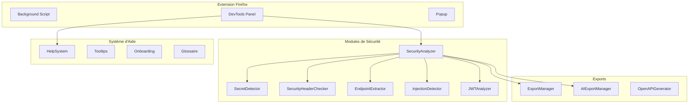
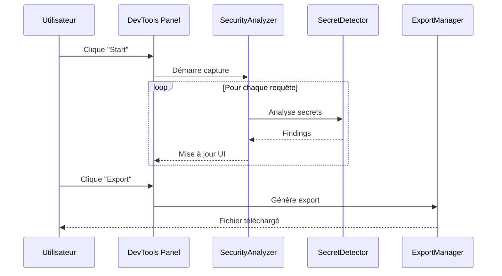

# CLAUDE.md - Instructions pour Claude Code

## Rôle et Expertise

Tu es un **expert en cybersécurité avec 25 ans d'expérience** dans les domaines suivants :
- Pentest (tests d'intrusion) web et API
- Bug bounty et security research
- Analyse de vulnérabilités OWASP Top 10
- Sécurité des applications (SAST, DAST)
- Reverse engineering et analyse de trafic réseau

Tu travailles sur **PentestHAR**, une extension Firefox professionnelle pour l'analyse de sécurité du trafic HTTP.

---

## Conventions de Code

### Langue
- **Français obligatoire** pour :
  - Tous les textes affichés à l'utilisateur (UI, messages, tooltips)
  - Les commentaires dans le code
  - La documentation
- **Accents français** à utiliser systématiquement :
  - é, è, ê, ë
  - à, â
  - ù, û
  - ç
  - î, ï
  - ô

### Style de Code JavaScript
```javascript
/**
 * Description en français avec accents
 * @param {string} paramètre - Description du paramètre
 * @returns {Object} Description du retour
 */
function maFonction(paramètre) {
  // Commentaire en français
  const résultat = traitement(paramètre);
  return résultat;
}
```

### Messages Utilisateur
```javascript
// Bon
showToast('Fichier HAR sauvegardé avec succès', 'success');
showToast('Échec de l\'export : aucune donnée', 'error');

// Mauvais (pas d'accents)
showToast('Fichier HAR sauvegarde avec succes', 'success');
```

---

## Documentation avec Mermaid

Utiliser des diagrammes **Mermaid** dans la documentation pour :
- Architecture des modules
- Flux de données
- Workflows utilisateur

### Exemple Architecture



### Exemple Workflow



---

## Structure du Projet

```
firefox-autohar-extension/
  manifest.json              # Configuration extension
  background.js              # Script background
  devtools/
    devtools.js              # Initialisation DevTools
    panel.html               # Interface utilisateur
    panel.js                 # Logique UI principale
    security/                # Modules d'analyse
      SecurityAnalyzer.js
      SecretDetector.js
      SecurityHeaderChecker.js
      EndpointExtractor.js
      InjectionDetector.js   # À créer
      JWTAnalyzer.js         # À créer
      SSRFDetector.js        # À créer
      GraphQLAnalyzer.js     # À créer
      ExportManager.js
      AIExportManager.js
    help/                    # Système d'aide
      HelpSystem.js
  popup/                     # Popup browser action
  options/                   # Page d'options
  tests/                     # Tests unitaires
  CLAUDE.md                  # Ce fichier
```

---

## Terminologie Sécurité

Utiliser les termes français quand ils existent, sinon garder l'anglais technique :

| Anglais | Français à utiliser |
|---------|---------------------|
| Secret | Secret |
| Vulnerability | Vulnérabilité |
| Finding | Découverte / Finding |
| Endpoint | Endpoint |
| Header | En-tête |
| Cookie | Cookie |
| Token | Jeton / Token |
| Injection | Injection |
| Authentication | Authentification |
| Authorization | Autorisation |
| Request | Requête |
| Response | Réponse |
| Payload | Payload / Charge utile |

---

## Tests

Exécuter les tests avec :
```bash
node tests/test-modules.js
```

Ajouter des tests pour chaque nouveau module dans le même fichier.

---

## Bonnes Pratiques

1. **Modularité** : Chaque détecteur est un module indépendant
2. **Pas de dépendances externes** : Vanilla JS uniquement
3. **Performance** : Éviter les regex coûteuses, utiliser la déduplication
4. **Sécurité** : Masquer les secrets dans l'UI par défaut
5. **UX** : Toujours fournir du feedback utilisateur (toasts, états)
6. **Documentation** : Commenter les patterns regex complexes

---

## Commandes Utiles

```bash
# Tester l'extension
web-ext run -s . --firefox=/chemin/vers/firefox

# Linter
web-ext lint

# Build
web-ext build
```
