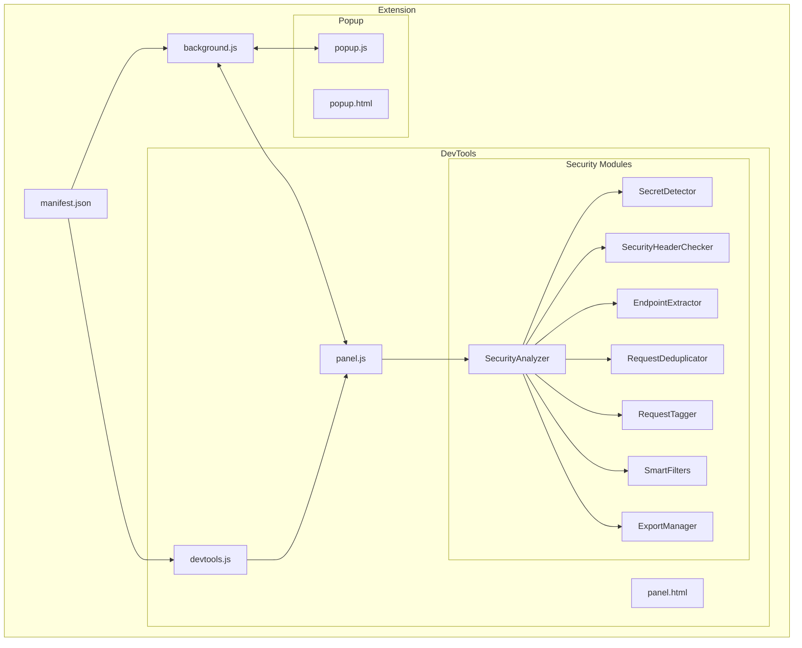
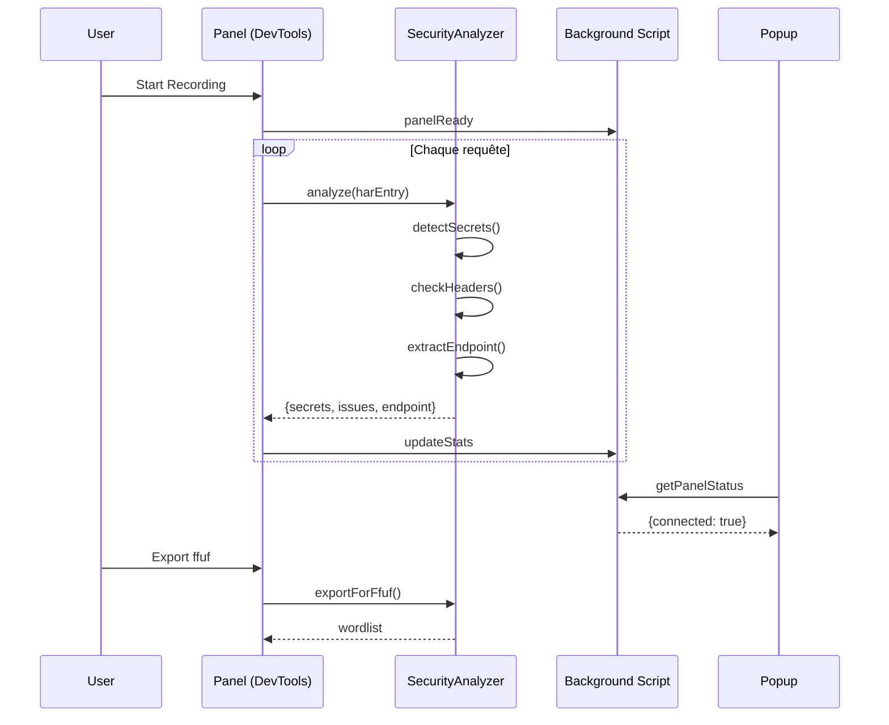
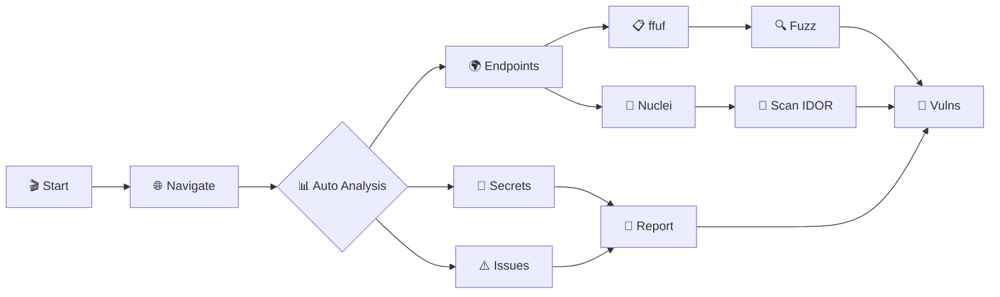
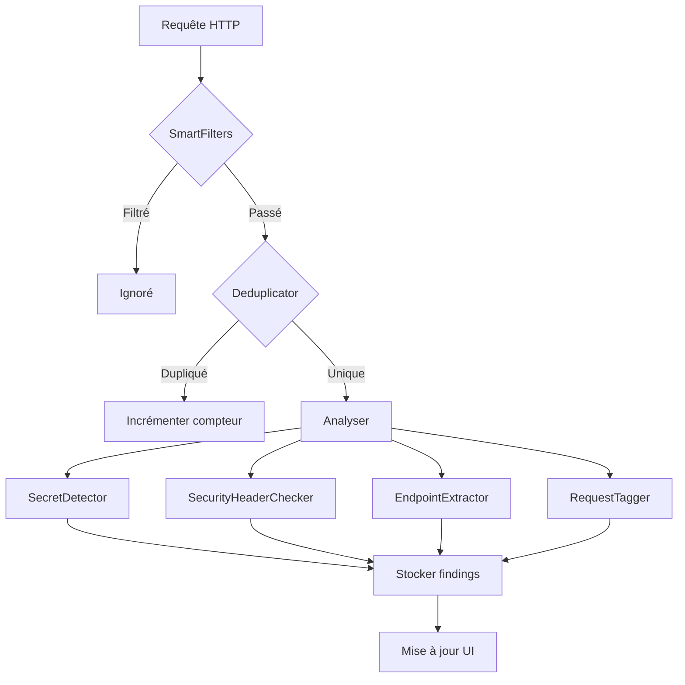

# PentestHAR Pentest Edition - Firefox Extension

Extension Firefox pour la capture et l'analyse de sécurité du trafic réseau en format HAR (HTTP Archive).

## Fonctionnalités

### Capture
- **Capture automatique** : Enregistre toutes les requêtes réseau
- **Auto-save** : Sauvegarde le fichier HAR quand un seuil de taille est atteint
- **Navigation privée** : Fonctionne en mode incognito
- **Filtrage par domaine** : Capture uniquement les domaines souhaités

### Analyse de Sécurité
- **Détection de secrets** : JWT (avec décodage), AWS keys, GCP keys, Stripe, GitHub tokens, Bearer tokens
- **Headers de sécurité** : CSP, HSTS, X-Frame-Options, cookies non sécurisés
- **Détection CORS** : Wildcards, réflexion d'origine, credentials
- **Détection IDOR** : Patterns d'IDs séquentiels avec score de confiance

### Smart Filters
- **Ignore static** : Exclut automatiquement JS, CSS, images, fonts
- **API only** : Capture uniquement les endpoints API
- **Exclude 3rd party** : Ignore les domaines tiers (analytics, CDN)
- **Déduplication** : Ignore les requêtes identiques

### Exports
- **ffuf** : Wordlist d'endpoints pour fuzzing
- **curl** : Commandes curl reproductibles
- **Postman** : Collection importable
- **Params wordlist** : Liste de tous les paramètres
- **Markdown report** : Rapport de sécurité complet
- **Nuclei templates** : Templates YAML pour IDOR

### AI Export (Nouveau)
- **AI Brief** : Résumé structuré optimisé pour analyse IA
- **Scénarios d'attaque** : Scénarios générés depuis les findings
- **OpenAPI Spec** : Reconstruction automatique de la spécification API
- **Export Chunked** : Données découpées pour contextes IA limités
- **8 prompts par défaut** : Recon, IDOR, JWT, Secrets, API, Offensive, Reporting, Quick Wins
- **Prompts personnalisés** : Stockage LocalStorage, variables dynamiques

## Installation

### Méthode 1 : Installation temporaire (développement)

1. Ouvrir Firefox
2. Aller à `about:debugging#/runtime/this-firefox`
3. Cliquer sur "Charger un module temporaire..."
4. Sélectionner le fichier `manifest.json`

### Méthode 2 : Installation permanente

```bash
cd firefox-pentesthar-extension
zip -r pentesthar.xpi * -x "*.git*"
```

Puis `about:addons` -> Icône engrenage -> "Installer un module depuis un fichier..."

## Utilisation

1. **Ouvrir les DevTools** (F12)
2. **Aller à l'onglet "PentestHAR"**
3. **Cliquer sur "Start"** pour démarrer la capture
4. **Naviguer** sur le site à analyser
5. **Onglet Security** : Voir les secrets et vulnérabilités détectés
6. **Onglet Endpoints** : Lister les endpoints uniques et IDOR candidates
7. **Onglet Export** : Exporter pour ffuf, Burp, nuclei...

> **Note** : L'ouverture des DevTools est obligatoire ([bug 1310037](https://bugzilla.mozilla.org/show_bug.cgi?id=1310037)).

## Onglets

### Capture
- Statistiques en temps réel (requêtes, taille)
- Progress bar avec seuil auto-save
- Smart filters configurables
- Activity log

### Security
- Compteurs par sévérité (Critical, High, Medium)
- Liste des secrets détectés avec JWT decode
- Issues de sécurité (headers, cookies, CORS)

### Endpoints
- Liste filtrable par méthode HTTP
- Recherche textuelle
- Indicateurs IDOR avec score de confiance
- Compteur de paramètres

### Export
- Preview du contenu exporté
- Copy to clipboard
- Download direct

### AI Export
- Quick exports (Brief, Scénarios, OpenAPI, Chunked)
- Prompts par catégorie avec variables dynamiques
- Preview avec estimation de tokens
- Gestion des prompts personnalisés

## Détection de Secrets

| Type | Pattern | Sévérité |
|------|---------|----------|
| JWT | `eyJ...` | High |
| AWS Access Key | `AKIA...` | Critical |
| GCP API Key | `AIza...` | High |
| Stripe Secret | `sk_live_...` | Critical |
| GitHub Token | `ghp_...` | Critical |
| Bearer Token | `Bearer ...` | High |
| Private Key | `-----BEGIN...` | Critical |

## Variables AI Prompts

| Variable | Description |
|----------|-------------|
| `{{target}}` | Domaine principal ciblé |
| `{{endpoints}}` | Liste des endpoints découverts |
| `{{secrets}}` | Secrets détectés (masqués) |
| `{{jwt_decoded}}` | JWT décodés avec claims |
| `{{idor_candidates}}` | Endpoints candidats IDOR |
| `{{security_issues}}` | Problèmes de sécurité |
| `{{parameters}}` | Paramètres uniques (query/body) |
| `{{auth_endpoints}}` | Endpoints d'authentification |
| `{{request_count}}` | Nombre de requêtes capturées |

## Architecture



## Communication inter-composants



## Workflow Bug Bounty



## Pipeline d'analyse



## Permissions

| Permission | Usage |
|------------|-------|
| `devtools` | Panel DevTools |
| `downloads` | Sauvegarder HAR |
| `storage` | Paramètres |
| `notifications` | Alertes |
| `<all_urls>` | Capture réseau |

## Limitations

- DevTools doit être ouvert manuellement
- Manifest V2 (devtools API non supportée MV3)
- Réponses binaires peuvent être tronquées

## Licence

MIT

---

*Créé pour faciliter les tests de sécurité autorisés.*
