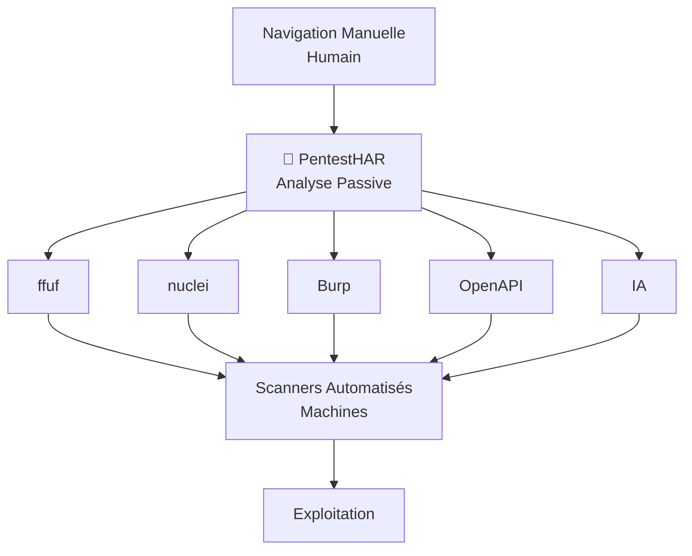
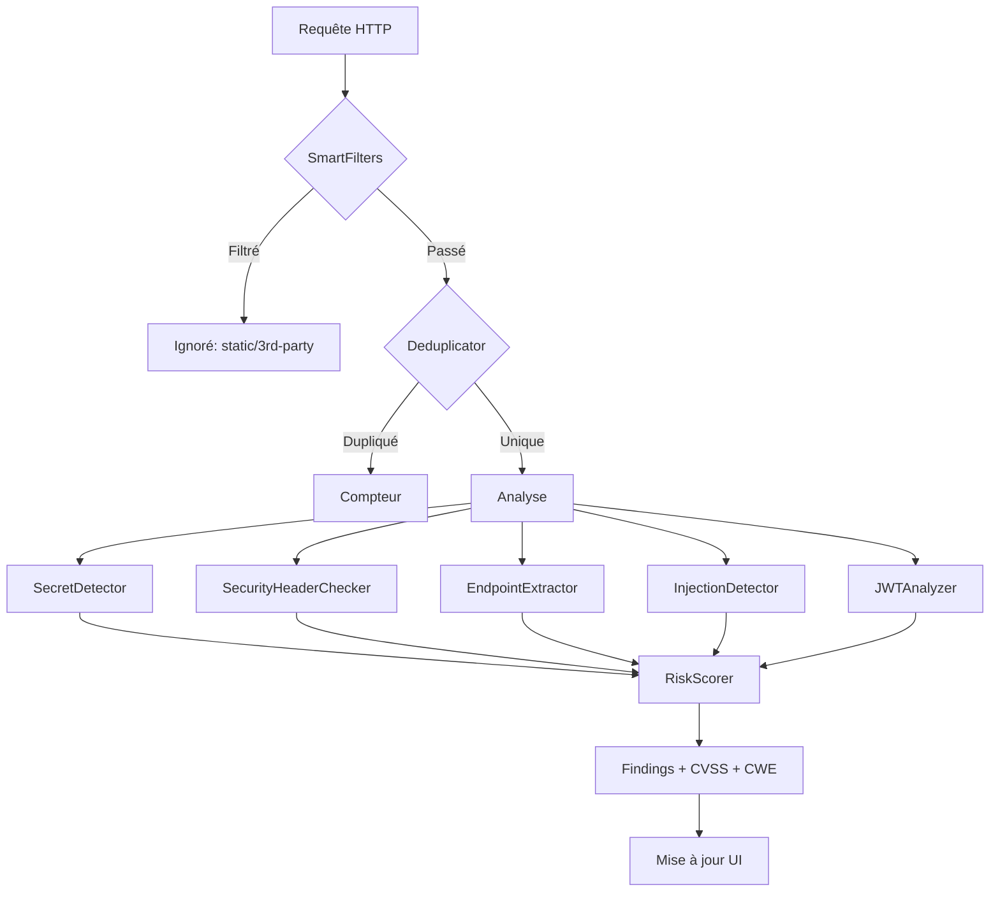
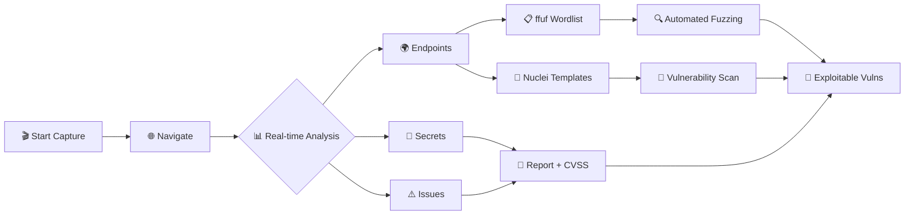
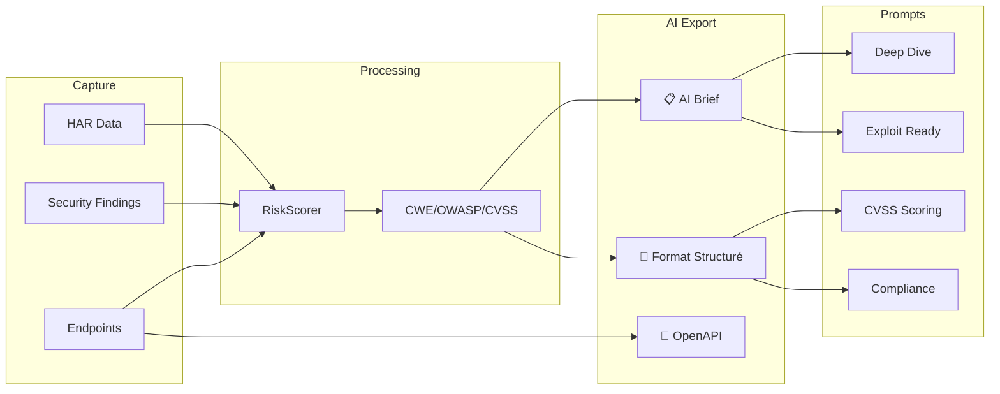

# 🎯 PentestHAR - Reconnaissance Automatisée pour Pentest

> **Extension Firefox** pour automatiser le diagnostic de vulnérabilités **en amont** des bots de détection (ffuf, nuclei, Burp, etc.)

[](manifest.json)
[](LICENSE)
[](tests/test-modules.js)

---

## 💡 Concept

**PentestHAR** est un **outil de reconnaissance passive** qui vous fait gagner 2-3 heures sur chaque audit :

1. **📡 Vous naviguez** manuellement sur l'application (30-60 min)
2. **🔍 PentestHAR analyse** automatiquement tout le trafic en temps réel
3. **🎯 Vous obtenez** :
   - Premier diagnostic de sécurité (secrets, IDOR, headers, JWT, injections)
   - Configurations prêtes pour vos scanners automatisés (ffuf, nuclei, Burp)
   - Surface d'attaque complète cartographiée (OpenAPI auto-générée)
   - Brief optimisé pour analyse IA (Claude, GPT)

### 🔄 Positionnement dans le Workflow



**Résultat** : Vous **commencez** avec des **findings concrets** au lieu de partir de zéro.

---

## ✨ Fonctionnalités Principales

### 🔍 Détection Automatique en Temps Réel

| Module | Détecte | Utilité |
|--------|---------|---------|
| **SecretDetector** | JWT, API keys (AWS, GCP, Stripe, GitHub), tokens | ⚡ Exploitation immédiate |
| **IDORDetector** | Endpoints avec IDs numériques/UUIDs | 🎯 Config ffuf/nuclei |
| **SecurityHeaders** | Headers manquants/faibles (CSP, HSTS, etc.) | 📊 Rapport compliance |
| **JWTAnalyzer** | JWT faibles (alg:none, HS256 weak) | 🔓 Tests d'auth |
| **InjectionDetector** | Points d'injection SQL/XSS/SSTI | 🧪 Templates nuclei |
| **EndpointExtractor** | Surface d'attaque complète | 📋 Wordlist ffuf |

### 📤 Exports pour Automation

#### 1️⃣ **ffuf Wordlists** - Fuzzing HTTP
```bash
# Export depuis PentestHAR
Export → ffuf Wordlist → endpoints.txt

# Lancer le fuzzing
ffuf -u https://target.com/FUZZ -w endpoints.txt -mc 200,403
```

#### 2️⃣ **Nuclei Templates** - Scan Vulnérabilités
```bash
# Export depuis PentestHAR
Export → Nuclei Config → findings.yaml

# Scanner automatiquement
nuclei -u https://target.com -t findings.yaml -severity critical,high
```

#### 3️⃣ **Burp Suite** - Tests Manuels
```bash
# Export HAR complet
Export → Full HAR → session.har

# Importer : Burp → Proxy → HTTP History → Import
```

#### 4️⃣ **OpenAPI Specification** - Documentation API
```yaml
# Reconstruction automatique de l'API
Export → OpenAPI Spec → api-spec.yaml

# Utiliser avec : Postman, Insomnia, schemathesis, restler
```

#### 5️⃣ **AI Analysis** - Analyse IA Optimisée
```markdown
# Export pour LLM (Claude, GPT)
AI Export → Format Structuré

# Résultat : JSON + Markdown avec :
- Scoring CVSS automatique (CWE/OWASP)
- Priorisation P0/P1/P2/P3
- Recommandations d'actions avec timeline
- 5 templates de prompts spécialisés
```

---

## 🚀 Installation

### ⚡ Installation Permanente (5 minutes) - Recommandée

Pour une installation qui **persiste aux redémarrages** :

```bash
# 1. Cloner
git clone https://github.com/venantvr-security/firefox-autohar-extension.git
cd firefox-autohar-extension

# 2. Configurer les clés API Mozilla (gratuit)
# Voir guide détaillé : MOZILLA.md

# 3. Installer automatiquement
./sign-and-install.sh
```

📖 **Guide complet** : [MOZILLA.md](MOZILLA.md) (étape par étape avec captures)

### 🧪 Installation Temporaire (30 secondes) - Tests rapides

```bash
make run
# Ou : web-ext run
```

⚠️ L'extension disparaîtra au redémarrage de Firefox.

---

## 📊 Cas d'Usage Typiques

### 1️⃣ Bug Bounty - Reconnaissance Rapide

**Gain de temps : 2-3h → 30 min**

```bash
# 1. Capturer le trafic
Firefox → F12 → PentestHAR → Start
# Naviguer : login, features, API calls (20-30 min)

# 2. Premier diagnostic immédiat
Security → Voir secrets/IDOR/issues en temps réel

# 3. Exporter pour scanners
Export → ffuf Wordlist
Export → Nuclei Config

# 4. Lancer automation
ffuf -u https://target.com/FUZZ -w endpoints.txt
nuclei -u https://target.com -t findings.yaml

# 5. Prioriser avec IA
AI Export → Format Structuré
# Copier dans Claude/GPT
```

**Résultat** : Findings concrets + scanners configurés en 30 min

---

### 2️⃣ Pentest Interne - Audit Complet

**Objectif : API complètement cartographiée + rapport**

```bash
# 1. Session longue (1h)
PentestHAR → Start
# Naviguer dans TOUTES les fonctionnalités

# 2. Cartographie API automatique
Export → OpenAPI Spec
# Résultat : Documentation complète

# 3. Identifier secrets critiques
Security → Secrets
# API keys, tokens exposés

# 4. Tester IDOR
Security → IDOR Candidates
Export → Burp (tests manuels)

# 5. Rapport avec scoring
AI Export → Analyse Structurée
# CVSS, CWE, OWASP, recommandations
```

**Résultat** : Rapport professionnel + configs scanners

---

### 3️⃣ Red Team - Découverte de Secrets

**Objectif : Trouver des secrets exposés**

```bash
# 1. Capture ciblée
PentestHAR → Start
# Focus : API calls, responses JSON

# 2. Filtrer secrets
Filters → Show Only: Secrets

# 3. Exploitation immédiate
# Copier les tokens détectés
curl -H "Authorization: Bearer <token>" https://api.target.com

# 4. Export pour équipe
Export → AI Brief (secrets masqués avec contexte)
```

**Résultat** : Exploitation en temps réel

---

### 4️⃣ DevSecOps - CI/CD Integration

**Objectif : Tests automatisés**

```javascript
// Pipeline CI/CD avec Playwright/Selenium
// PentestHAR capture en arrière-plan

// Vérifier secrets en prod
if (findings.secrets.length > 0) {
  console.error('❌ Secrets détectés !');
  process.exit(1);
}

// Générer rapport
pentesthar.generateReport() → security-report.md
```

**Résultat** : Shift-left security

---

## 🏗️ Architecture

### Modules de Détection

**SecurityAnalyzer** - Détection automatique
- **SecretDetector** : API keys, tokens, credentials
- **IDORDetector** : Numeric IDs, UUIDs, patterns
- **SecurityHeaderChecker** : CSP, HSTS, X-Frame-Options
- **JWTAnalyzer** : JWT decode, weak algorithms
- **InjectionDetector** : SQL, XSS, SSTI points
- **EndpointExtractor** : Surface d'attaque complète

**RiskScorer** - Scoring composite intelligent
- **CVSS v3 Calculator** : Score de risque standardisé
- **CWE Mapping** : 200+ vulnérabilités
- **OWASP Top 10 2021** : Classification automatique
- **Priority Assignment** : P0/P1/P2/P3 automatique

**ExportManager** - Exports spécialisés
- **ffuf Wordlists** : Fuzzing HTTP
- **Nuclei Templates** : Scan automatisé
- **Burp Suite (HAR)** : Tests manuels
- **OpenAPI Spec** : Documentation API

**AIExportManager** - Exports IA optimisés
- **Pyramide Inversée** : Info critique en premier
- **Format JSON+Markdown** : Parsing automatique + narratif
- **Enrichissement Auto** : CWE/OWASP/CVSS
- **5 Templates Prompts** : Analyse spécialisée

---

## 📈 Workflow Détaillé

### Pipeline d'Analyse



### Workflow Bug Bounty



### Workflow AI Export



---

## 🧪 Tests et Qualité

```bash
# Exécuter les tests
make test

# Résultats
📍 SecretDetector          7/7   ✓
📍 EndpointExtractor       9/9   ✓
📍 SecurityHeaderChecker   4/4   ✓
📍 PromptTemplateStore     8/8   ✓
📍 SmartFilters            3/3   ✓
📍 RequestDeduplicator     2/2   ✓
📍 RequestTagger           8/8   ✓
📍 HelpSystem              7/7   ✓
📍 ExportManager           7/7   ✓
📍 InjectionDetector       9/9   ✓
📍 JWTAnalyzer             8/8   ✓
📊 RiskScorer             10/10  ✓

==================================================
Résultats: 84 passés, 0 échoués
==================================================
```

---

## 🔗 Intégration avec Outils

### ffuf (Fuzzing HTTP)

```bash
# Export depuis PentestHAR
Export → ffuf Wordlist → endpoints.txt

# Fuzzing de chemins
ffuf -u https://target.com/FUZZ \
     -w endpoints.txt \
     -mc 200,403,500

# Fuzzing de paramètres
ffuf -u 'https://target.com/api?FUZZ=test' \
     -w parameters.txt
```

### Nuclei (Scan Automatisé)

```bash
# Export depuis PentestHAR
Export → Nuclei Config → findings.yaml

# Scan avec templates custom
nuclei -u https://target.com \
       -t findings.yaml \
       -severity critical,high

# Scan avec templates communautaires
nuclei -u https://target.com \
       -t nuclei-templates/ \
       -severity medium,high,critical
```

### Burp Suite (Tests Manuels)

```bash
# Export HAR
Export → Full HAR → session.har

# Importer
Burp → Proxy → HTTP History → Import
# Toutes les requêtes sont importées avec contexte
```

### curl/httpie (Tests Rapides)

```bash
# Copier depuis PentestHAR
Clic droit → Copy as curl

# Modifier pour tester IDOR
curl 'https://api.target.com/users/123' \
  -H 'Authorization: Bearer eyJ...'

# Tester autre ID
curl 'https://api.target.com/users/124' \
  -H 'Authorization: Bearer eyJ...'
```

---

## 🛠️ Commandes Utiles

```bash
# Développement
make run          # Lancer Firefox avec l'extension
make test         # Tests unitaires (84 tests)
make watch        # Mode rechargement auto
make dev          # Tests + Run

# Build et Signature
make build            # Package non signé (.zip)
make release-signed   # Package signé (.xpi) - installation permanente
make clean            # Nettoyer builds

# Information
make help        # Liste toutes les commandes
make sign-info   # Instructions signature locale
make version     # Version actuelle
make info        # Stats projet
```

---

## 📚 Documentation

| Document | Description |
|----------|-------------|
| **[MOZILLA.md](MOZILLA.md)** | Installation permanente (5 min) |
| **[Makefile](Makefile)** | Toutes les commandes (350+ lignes) |
| **[CLAUDE.md](CLAUDE.md)** | Instructions développement |
| **[docs/BUILD_AND_RELEASE.md](docs/BUILD_AND_RELEASE.md)** | Build, release, distribution |
| **[docs/GUIDE_SIGNATURE_LOCALE.md](docs/GUIDE_SIGNATURE_LOCALE.md)** | Signature pas-à-pas |
| **[docs/AI_EXPORT_OPTIMIZATION.md](docs/AI_EXPORT_OPTIMIZATION.md)** | Exports IA optimisés |
| **[docs/CHANGELOG_AI_OPTIMIZATION.md](docs/CHANGELOG_AI_OPTIMIZATION.md)** | Changelog v2.1.0 |

---

## 🏆 Avantages vs Autres Outils

| Critère | PentestHAR | Burp Suite | ZAP Proxy | HAR Manual |
|---------|------------|------------|-----------|------------|
| **Reconnaissance passive** | ✅ Auto | ⚠️ Manuelle | ⚠️ Semi-auto | ❌ Non |
| **Export scanners** | ✅ ffuf, nuclei | ⚠️ Limité | ⚠️ XML | ❌ Non |
| **Analyse IA** | ✅ Optimisée | ❌ Non | ❌ Non | ❌ Non |
| **OpenAPI auto** | ✅ Oui | ❌ Non | ❌ Non | ❌ Non |
| **Scoring CVSS** | ✅ Auto | ⚠️ Manuel | ⚠️ Manuel | ❌ Non |
| **Gratuit** | ✅ MIT | ❌ Payant Pro | ✅ Open Source | ✅ Natif |
| **Installation** | ✅ Extension | ⚠️ Lourd | ⚠️ Java | ✅ Natif |
| **Temps setup** | ✅ 5 min | ⚠️ 30 min | ⚠️ 20 min | ✅ 0 min |

---

## 📊 Métriques et Performance

| Métrique | Valeur |
|----------|--------|
| **Tests unitaires** | 84/84 (100%) |
| **Détecteurs actifs** | 11 modules |
| **CWE mappés** | 200+ vulnérabilités |
| **Formats d'export** | 8 formats |
| **Templates IA** | 5 prompts optimisés |
| **Réduction tokens** | -44% (8000→4500) |
| **Pertinence LLM** | +25% (65%→90%) |

---

## 🎓 Détection de Secrets

| Type | Pattern | Sévérité | Action Recommandée |
|------|---------|----------|---------------------|
| JWT | `eyJ...` | High | Décoder, vérifier alg:none |
| AWS Access Key | `AKIA...` | Critical | Rotate immédiatement |
| GCP API Key | `AIza...` | High | Révoquer + rotate |
| Stripe Secret | `sk_live_...` | Critical | Rotate (< 1h) |
| GitHub Token | `ghp_...` | Critical | Révoquer immédiatement |
| Bearer Token | `Bearer ...` | High | Tester validité |
| Private Key | `-----BEGIN...` | Critical | Rotate + audit logs |

---

## 📞 Support

- **Issues** : https://github.com/venantvr-security/firefox-autohar-extension/issues
- **Documentation** : [docs/](docs/)
- **Tests** : `make test`

---

## 📄 License

MIT License - Copyright (c) 2024 venantvr-security

---

## 🙏 Crédits

Développé par **venantvr-security** avec l'aide de **Claude Code** (Anthropic).

**Technologies** :
- Vanilla JavaScript (pas de dépendances)
- WebExtensions API (Firefox)
- Mermaid (diagrammes)
- web-ext (build)

---

## 🚀 Quick Start (30 secondes)

```bash
# Test immédiat (temporaire)
git clone https://github.com/venantvr-security/firefox-autohar-extension.git
cd firefox-autohar-extension
make run

# Installation permanente (5 min)
./sign-and-install.sh
```

### Premier Diagnostic (2 minutes)

1. **Firefox → F12 → Onglet "PentestHAR"**
2. **Cliquer "Start Capture"**
3. **Naviguer** sur l'application cible (login, features)
4. **Onglet "Security"** → Voir findings en temps réel
5. **Export → ffuf/nuclei** → Lancer vos scanners

**Résultat : Findings concrets en 2 minutes** 🎯

---

*Créé pour **automatiser le diagnostic en amont** des bots de détection de failles.*
