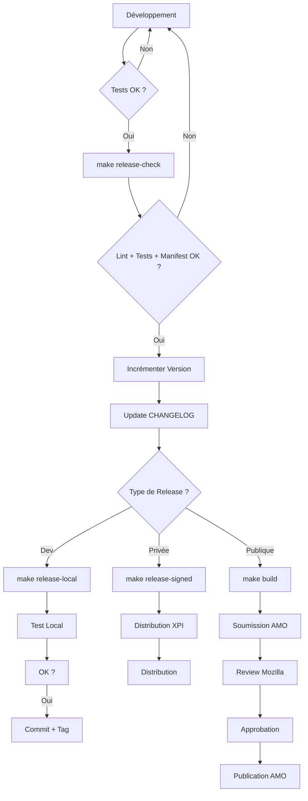

# 🏗️ Guide de Build et Release - PentestHAR

**Version**: 2.1.0
**Date**: 2026-04-16

---

## 📋 Table des Matières

1. [Prérequis](#prérequis)
2. [Installation](#installation)
3. [Commandes Makefile](#commandes-makefile)
4. [Développement Local](#développement-local)
5. [Build et Packaging](#build-et-packaging)
6. [Signature de l'Extension](#signature-de-lextension)
7. [Distribution](#distribution)
8. [Workflow de Release](#workflow-de-release)

---

## 🔧 Prérequis

### Outils Requis

```bash
# Node.js et npm
node --version   # >= 14.x
npm --version    # >= 6.x

# Firefox
firefox --version   # >= 78.0

# Make (généralement préinstallé sur Linux/macOS)
make --version

# web-ext (sera installé automatiquement)
```

### Installation des Outils

```bash
# Installation de web-ext
make install

# Ou manuellement
npm install --global web-ext
```

---

## 📦 Installation

```bash
# Cloner le projet
git clone https://github.com/venantvr-security/firefox-autohar-extension.git
cd firefox-autohar-extension

# Installer web-ext
make install

# Vérifier la configuration
make info
```

---

## ⚡ Commandes Makefile

### Aide et Information

```bash
make help              # Affiche toutes les commandes disponibles
make info              # Informations sur le projet
make version           # Version actuelle
make sign-info         # Instructions de signature
```

### Développement

```bash
make test              # Exécute les tests unitaires
make lint              # Vérifie la conformité du code
make check             # Lint + Tests

make run               # Lance Firefox avec l'extension
make run-clean         # Lance avec un profil propre
make watch             # Mode watch (rechargement auto)
make dev               # Tests + Run (workflow complet)
```

### Build et Release

```bash
make clean             # Nettoie les fichiers de build
make build             # Build l'extension (non signée)
make package           # Alias de build

make release-check     # Vérifications pré-release
make release-local     # Release locale (non signée)
make release-signed    # Release signée (nécessite API keys)
```

### CI/CD

```bash
make ci                # Pipeline CI complet (lint + test + build)
make validate-manifest # Valide manifest.json
```

---

## 🖥️ Développement Local

### Lancer l'Extension en Dev

```bash
# Méthode 1 : Workflow complet (recommandé)
make dev

# Méthode 2 : Lancement direct
make run

# Méthode 3 : Avec rechargement automatique
make watch
```

### Tester les Modifications

```bash
# Tests unitaires
make test

# Lint
make lint

# Vérifications complètes
make check
```

### Résultat Attendu

```
🧪 Exécution des tests...
84 tests passés, 0 échoués

🔍 Linting du code...
✓ 0 errors, 0 warnings

🚀 Lancement de Firefox...
```

---

## 📦 Build et Packaging

### Build Simple (Non Signé)

```bash
make build
```

**Produit** : `web-ext-artifacts/pentesthar-2.1.0.zip`

**Usage** :
- Tests locaux uniquement
- Installation temporaire dans Firefox Developer/Nightly

### Build avec Vérifications Complètes

```bash
make release-local
```

**Effectue** :
1. ✅ Lint du code
2. ✅ Tests unitaires
3. ✅ Validation du manifest
4. ✅ Build du package

**Produit** : `web-ext-artifacts/*.zip`

---

## 🔐 Signature de l'Extension

### ⚠️ Important : Quand Faut-il Signer ?

| Cas d'Usage | Signature Requise ? |
|-------------|---------------------|
| **Développement local** (`make run`) | ❌ Non |
| **Firefox Developer/Nightly** | ❌ Non (avec config) |
| **Firefox Release standard** | ✅ Oui |
| **Distribution publique (AMO)** | ✅ Oui (par Mozilla) |
| **Auto-distribution** | ✅ Oui (par vous) |

### Option 1 : Firefox Developer/Nightly (Sans Signature)

**Avantage** : Pas besoin de signature
**Inconvénient** : Version de développement uniquement

```bash
# 1. Installer Firefox Developer Edition
# https://www.mozilla.org/firefox/developer/

# 2. Désactiver la vérification de signature
# Dans about:config :
xpinstall.signatures.required = false

# 3. Installer l'extension
# about:debugging#/runtime/this-firefox
# → Load Temporary Add-on
# → Sélectionner manifest.json
```

### Option 2 : Signature Locale (Auto-Distribution)

**Avantage** : Fonctionne sur Firefox Release
**Inconvénient** : Nécessite des clés API Mozilla

#### Étape 1 : Obtenir les Clés API

1. **Créer un compte** : https://addons.mozilla.org
2. **Générer des clés** : https://addons.mozilla.org/developers/addon/api/key/
3. **Récupérer** :
   - `API Key (JWT issuer)` : Format `user:12345:67`
   - `API Secret` : Longue chaîne alphanumérique

#### Étape 2 : Configurer les Variables

```bash
# Copier le template
cp .env.example .env

# Éditer .env avec vos clés
nano .env
```

**Contenu de .env** :
```bash
export WEB_EXT_API_KEY='user:12345:67'
export WEB_EXT_API_SECRET='votre_secret_ici'
```

#### Étape 3 : Charger les Variables

```bash
# Charger les variables
source .env

# Vérifier la configuration
make sign-info
```

**Résultat attendu** :
```
Variables d'environnement actuelles :
  WEB_EXT_API_KEY    : ✓ Configurée
  WEB_EXT_API_SECRET : ✓ Configurée
```

#### Étape 4 : Signer l'Extension

```bash
make release-signed
```

**Produit** : `web-ext-artifacts/pentesthar-2.1.0.xpi` (signé)

#### Étape 5 : Installer le XPI Signé

```bash
# Ouvrir Firefox
firefox web-ext-artifacts/pentesthar-2.1.0.xpi

# Ou depuis Firefox :
# about:debugging#/runtime/this-firefox
# → Install Add-on From File
# → Sélectionner le .xpi
```

### Option 3 : Distribution Publique (AMO)

**Avantage** : Visibilité maximale, distribution automatique
**Inconvénient** : Review manuelle par Mozilla (plusieurs jours)

#### Processus

1. **Build l'extension** :
   ```bash
   make release-check
   make build
   ```

2. **Soumettre à AMO** :
   - Aller sur https://addons.mozilla.org/developers/
   - Cliquer "Submit New Add-on"
   - Uploader `web-ext-artifacts/*.zip`
   - Remplir les métadonnées
   - Soumettre pour review

3. **Review Mozilla** :
   - Vérification automatique
   - Review manuelle (2-7 jours)
   - Signature automatique si approuvé

4. **Distribution** :
   - Publication automatique sur AMO
   - Mises à jour automatiques pour les utilisateurs

---

## 🚀 Distribution

### Comparaison des Méthodes

| Méthode | Signature | Installation | Mises à Jour | Audience |
|---------|-----------|--------------|--------------|----------|
| **Dev Local** | Non | Manuelle | Manuelle | Développeur seul |
| **XPI Signé** | Oui (vous) | Fichier XPI | Manuelle | Distribution privée |
| **AMO** | Oui (Mozilla) | Store | Automatique | Public |
| **Enterprise** | Oui | GPO/SCCM | Centralisée | Entreprise |

### Recommandation par Cas d'Usage

- **Tests/Développement** → `make run`
- **Tests Privés** → `make release-signed`
- **Pentest Interne** → XPI signé + distribution interne
- **Bug Bounty Hunters** → XPI signé ou AMO
- **Public** → AMO

---

## 📊 Workflow de Release

### Workflow Complet



### Commandes Pas à Pas

#### 1. Préparer la Release

```bash
# Vérifier l'état du projet
make check
git status

# Vérifications pré-release
make release-check
```

#### 2. Mettre à Jour la Version

```bash
# Éditer manifest.json
nano manifest.json

# Modifier version: "2.1.0" → "2.2.0"

# Vérifier
make version
```

#### 3. Mettre à Jour le Changelog

```bash
# Créer une nouvelle section
echo "## [2.2.0] - $(date +%Y-%m-%d)" >> CHANGELOG.md
echo "### Added" >> CHANGELOG.md
echo "- Nouvelle fonctionnalité..." >> CHANGELOG.md
```

#### 4. Build et Test

```bash
# Build
make build

# Test du package
make run-clean

# Test avec le ZIP
# about:debugging → Load Temporary Add-on
# → Sélectionner web-ext-artifacts/*.zip
```

#### 5. Commit et Tag

```bash
# Commit des changements
git add manifest.json CHANGELOG.md
git commit -m "chore: Version 2.2.0"

# Créer un tag
git tag -a v2.2.0 -m "Release 2.2.0"

# Push
git push origin main
git push origin v2.2.0
```

#### 6. Distribution

**Option A : Signature Locale**
```bash
# Charger les clés API
source .env

# Signer
make release-signed

# Distribuer le XPI
# Uploader sur votre serveur ou partager directement
```

**Option B : AMO**
```bash
# Build final
make build

# Soumettre manuellement sur AMO
# https://addons.mozilla.org/developers/
```

---

## 🔍 Troubleshooting

### Erreur : "web-ext: command not found"

```bash
# Installer web-ext
make install

# Ou manuellement
npm install -g web-ext
```

### Erreur : "API Key manquante"

```bash
# Vérifier la configuration
make sign-info

# Charger les variables
source .env

# Vérifier à nouveau
make sign-info
```

### Erreur : "Manifest invalide"

```bash
# Valider le manifest
make validate-manifest

# Vérifier la syntaxe JSON
jq . manifest.json

# Lint complet
make lint
```

### Extension Non Chargée dans Firefox

```bash
# Vérifier les permissions
ls -la manifest.json

# Vérifier la structure
web-ext lint

# Tester avec un profil propre
make run-clean
```

### Tests Échoués

```bash
# Exécuter les tests avec détails
node tests/test-modules.js

# Vérifier les modules individuellement
node -e "require('./devtools/security/RiskScorer.js')"
```

---

## 📚 Ressources

### Documentation Mozilla

- **web-ext** : https://extensionworkshop.com/documentation/develop/web-ext-command-reference/
- **Signature** : https://extensionworkshop.com/documentation/publish/signing-and-distribution-overview/
- **AMO API** : https://addons-server.readthedocs.io/en/latest/topics/api/signing.html
- **Manifest v2** : https://developer.mozilla.org/en-US/docs/Mozilla/Add-ons/WebExtensions/manifest.json

### Outils

- **web-ext** : https://github.com/mozilla/web-ext
- **AMO** : https://addons.mozilla.org/developers/
- **Clés API** : https://addons.mozilla.org/developers/addon/api/key/

---

## ✅ Checklist Pré-Release

- [ ] Tous les tests passent (`make test`)
- [ ] Lint sans erreurs (`make lint`)
- [ ] Manifest valide (`make validate-manifest`)
- [ ] Version incrémentée dans `manifest.json`
- [ ] CHANGELOG mis à jour
- [ ] Documentation à jour
- [ ] Test en environnement propre (`make run-clean`)
- [ ] Commit des changements
- [ ] Tag créé (`git tag -a vX.X.X`)
- [ ] Build final testé (`make build`)
- [ ] Push vers GitHub (`git push --tags`)

---

**Auteur** : venantvr-security
**License** : MIT
**Support** : https://github.com/venantvr-security/firefox-autohar-extension/issues
